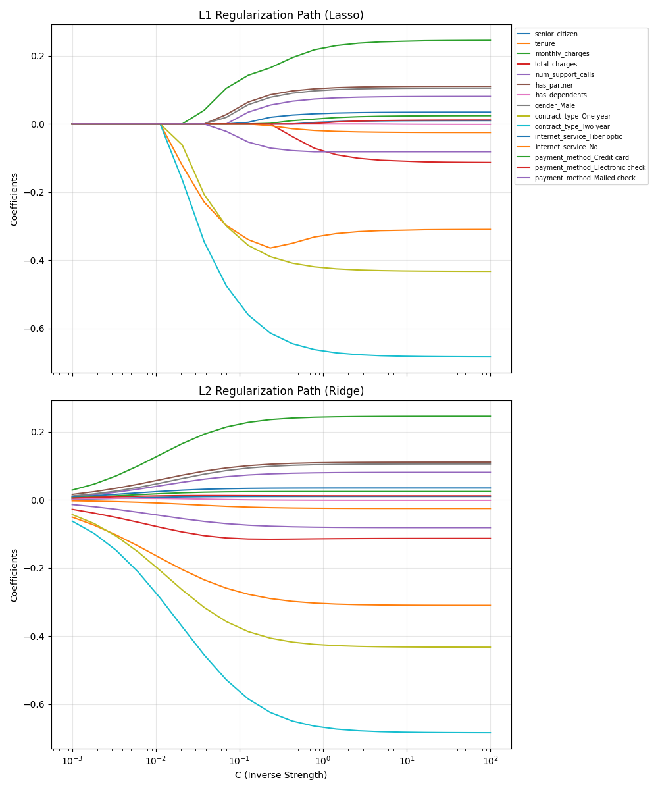

# Module 5 Stretch: Regularization Explorer (Honors Track)

## Project Overview
This project visualizes how **L1 (Lasso)** and **L2 (Ridge)** regularization influence the coefficients of a Logistic Regression model. I used the telecom churn dataset to demonstrate feature selection and coefficient shrinkage.

## Regularization Path Visualization

---

## Project Analysis & Interpretation

Based on the generated plots, here is the technical breakdown:

### 1. L1 Regularization (Lasso) - Feature Selection
* **Observation:** In the top plot, as we move to the left (stronger regularization), most coefficients drop to **exactly zero**. 
* **Key Finding:** Features like `total_charges`, `num_support_calls`, and `has_dependents` are eliminated early. The most robust feature that resists zeroing out the longest is `contract_type_Two_year`, followed by `monthly_charges`.
* **Behavior:** L1 creates a **sparse model**, effectively performing automatic feature selection.

### 2. L2 Regularization (Ridge) - Coefficient Shrinkage
* **Observation:** In the bottom plot, all coefficients shrink in magnitude as regularization increases, but they **never reach zero**. 
* **Key Finding:** Even with very strong regularization, every feature remains in the model with a small weight. This helps handle multicollinearity by distributing weights across correlated features.

---

## Final Recommendation
I recommend using **L1 Regularization (Lasso)** for this dataset.

**Why?**
1. **Model Simplicity:** The plot shows that only a few features (like Contract Type and Monthly Charges) carry significant predictive weight.
2. **Interpretability:** By zeroing out noise-heavy features (like `gender` or certain `payment_methods`), L1 provides a clear, actionable list of churn drivers for the business.
3. **Robustness:** Eliminating redundant features reduces the risk of overfitting in production.

---
# Module 5 Stretch: Regularization Explorer (Honors Track)

## Project Overview
This project visualizes how **L1 (Lasso)** and **L2 (Ridge)** regularization influence the coefficients of a Logistic Regression model. I used the telecom churn dataset to demonstrate feature selection and coefficient shrinkage.

## Regularization Path Visualization

---

## Project Analysis & Interpretation

Based on the generated plots, here is the technical breakdown:

### 1. L1 Regularization (Lasso) - Feature Selection
* **Observation:** In the top plot, as we move to the left (stronger regularization), most coefficients drop to **exactly zero**. 
* **Key Finding:** Features like `total_charges`, `num_support_calls`, and `has_dependents` are eliminated early. The most robust feature that resists zeroing out the longest is `contract_type_Two_year`, followed by `monthly_charges`.
* **Behavior:** L1 creates a **sparse model**, effectively performing automatic feature selection.

### 2. L2 Regularization (Ridge) - Coefficient Shrinkage
* **Observation:** In the bottom plot, all coefficients shrink in magnitude as regularization increases, but they **never reach zero**. 
* **Key Finding:** Even with very strong regularization, every feature remains in the model with a small weight. This helps handle multicollinearity by distributing weights across correlated features.

---

## Final Recommendation
I recommend using **L1 Regularization (Lasso)** for this dataset.

**Why?**
1. **Model Simplicity:** The plot shows that only a few features (like Contract Type and Monthly Charges) carry significant predictive weight.
2. **Interpretability:** By zeroing out noise-heavy features (like `gender` or certain `payment_methods`), L1 provides a clear, actionable list of churn drivers for the business.
3. **Robustness:** Eliminating redundant features reduces the risk of overfitting in production.

---
